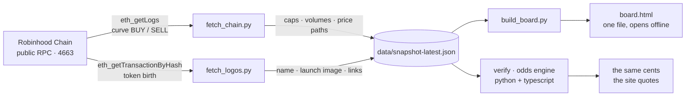

<p align="center">
  
</p>

<p align="center">
  <a href="#verify-a-price-in-30-seconds"></a>
  
  
  
  
  
</p>

<h3 align="center">Open tooling for <a href="https://predly.tech">Predly</a>: recompute every price, read the chain yourself, run the board offline.</h3>

---

**Predly** puts a prediction market on the market cap of every memecoin launched on
[Robinhood Chain](https://predly.tech) — *"will $SLOTH reach $154K within the hour"*, *"will
$PONS double from $493M before 21:35 UTC"*. Shares are quoted in cents, YES and NO always add up
to a dollar, and nobody votes on the outcome: resolution reads the cap off the chain.

A prediction market is only worth as much as its numbers are checkable. **This repository is the
check.** It holds the reference implementation of the pricing engine in two languages, the raw
chain readers the data comes from, an offline copy of the board, and the public snapshots. None
of it needs an account, an API key, or trust in us.

## Verify a price in 30 seconds

```bash
git clone https://github.com/Denis101Ka/predly-tools && cd predly-tools
python -m verify --cap 493e6 --target 986e6 --sigma 0.35 --hours 5.5
```

```
touch  d=0.8445  p_yes=0.3984  YES 40c / NO 60c
```

That is the same 40c the board shows for a `$PONS` day market with a `$493M` cap, a `$986M`
target and five and a half hours left. Replay every published example at once:

```bash
python -m verify --vectors     # 9/9 vectors reproduced
```

No install step, no dependencies, standard library only. The TypeScript engine that runs in the
browser is in this repo too, and CI replays the exact same vectors through both — so the number
on the screen, the number on the server and the number on your machine cannot drift apart quietly.

## How a price is made

The cap is treated as a driftless log-normal walk. For a **touch** market the reflection
principle gives the probability that the running maximum reaches the target before the deadline;
a **floor** market is the complement.

```
touch   d = ln(target / cap) / (σ · √τ)      p_yes = clamp( 2 · (1 − Φ(d)),  0.03, 0.97 )
floor   d = ln(cap / floor)  / (σ · √τ)      p_yes = clamp( 2 · Φ(d) − 1,    0.03, 0.97 )

σ   realized volatility per hour: sample std of 5-minute close-to-close log returns
    over the trailing six hours, × √12, clamped to [0.05, 3]
τ   hours left until the deadline, floored at one minute
Φ   standard normal CDF (Abramowitz & Stegun 26.2.17)

yes_c = clamp(round(p_yes · 100), 1, 99)     no_c = 100 − yes_c
```

Worked: `d = ln(986/493) / (0.35 · √5.5) = 0.6931 / 0.8208 = 0.8445`, so
`p = 2 · (1 − Φ(0.8445)) = 0.3984` → **40c YES / 60c NO**.

Why the goalposts move with volatility instead of sitting at a fixed percentage, and what that
does to a board where one token is worth half a billion and the next one is nine minutes old:
[docs/METHODOLOGY.md](docs/METHODOLOGY.md). What happens on a candle gap, a pool migration or an
exact touch: [docs/RULEBOOK.md](docs/RULEBOOK.md).

## Where the data comes from

Nothing in `data/` is typed by hand. `chain/fetch_chain.py` speaks to the public RPC directly,
reads the launchpad curve's own trade events, and prices every fill as the executed ratio of
quote to tokens.



| What | How it is derived | Where |
|---|---|---|
| Token list, caps, volumes, fill counts | curve `BUY` / `SELL` logs, price = quote ÷ tokens, cap = price × 1e9 supply | [chain/fetch_chain.py](chain/fetch_chain.py) |
| Launch name, image, links | strings inside the token's creation transaction, images pulled from IPFS | [chain/fetch_logos.py](chain/fetch_logos.py) |
| Odds in cents | the formula above, from the cap and the candles | [verify/odds.py](verify/odds.py) · [verify/odds.ts](verify/odds.ts) |
| Everything else on the board | a product preview, labelled `PREVIEW` on the panel itself | [board/build_board.py](board/build_board.py) |

The event topics, the decoding rules and the traps (a quote leg that flips units will put a cap
at ten billion dollars if you let it) are written up in [docs/CHAIN.md](docs/CHAIN.md).

## The board, offline

<p align="center">
  
</p>

```bash
python chain/fetch_chain.py 60000      # scan the last 60k blocks, about 1.7 hours of chain
python chain/fetch_logos.py            # pull each token's launch image
python board/build_board.py PREDLY     # write board/board.html
```

Open `board/board.html` in any browser. One file, no server, no build step: real caps, real
volumes, real price paths, real launch images, with every modelled panel badged `PREVIEW`.
Add `--shot 26000` to render it straight to a PNG instead.

## Layout

```
verify/     the odds engine, twice: odds.py and odds.ts, plus vectors.json and both test suites
chain/      the RPC readers that produce the snapshots
board/      the offline board generator
data/       snapshot-latest.json, the launch images, and the history of past snapshots
brand/      the banner generator, rendered from HTML so the type stays crisp
docs/       methodology, the market rulebook, chain notes
```

## What this repo is not

It is not the Predly application. The site's server and front end are closed; what lives here is
everything a visitor needs to audit the numbers, plus the tools that produced them.

Trading on the site is **paper only** at this stage: positions live in the visitor's browser, no
order is ever sent, and the wallet connection is read-only. The board and the site both say so on
the panel that deserves it. Odds are model-derived rather than bet-derived, which is stated
wherever a price appears.

## Tests

```bash
python -m unittest discover -s verify -p "test_*.py" -t .    # 12 tests, standard library
npm install && npm test                                       # 10 tests through the TypeScript build
```

Both suites replay [verify/vectors.json](verify/vectors.json). CI runs them on every push.

## Links

[predly.tech](https://predly.tech) · [security policy](SECURITY.md) ·
[contributing](CONTRIBUTING.md) · [MIT](LICENSE)
