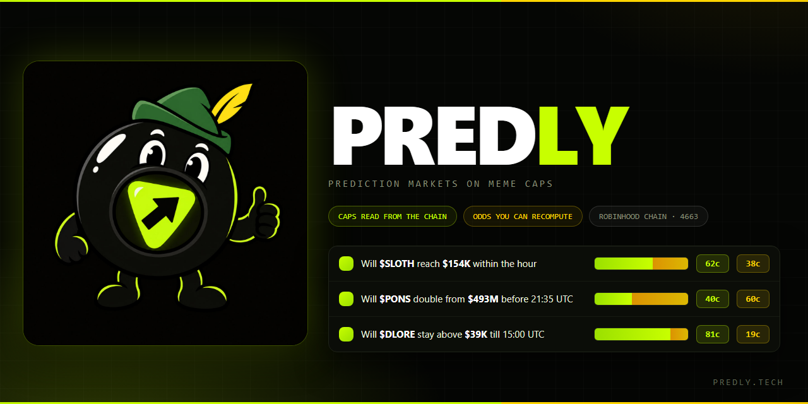
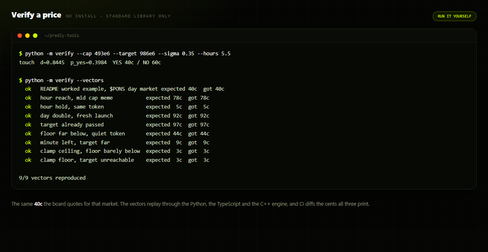
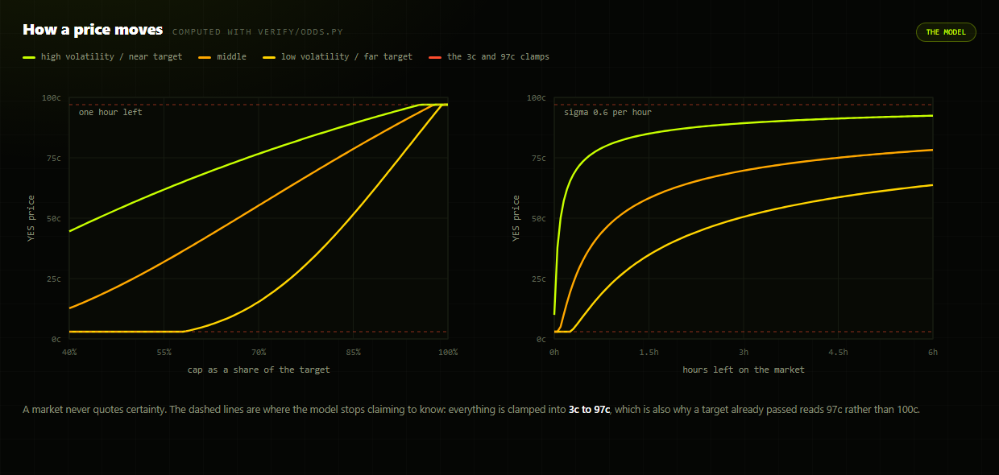
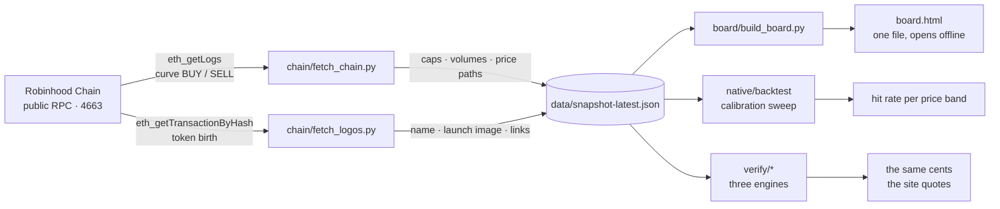
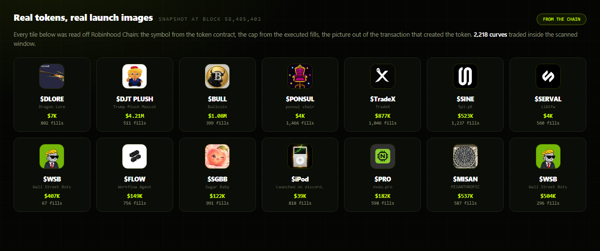
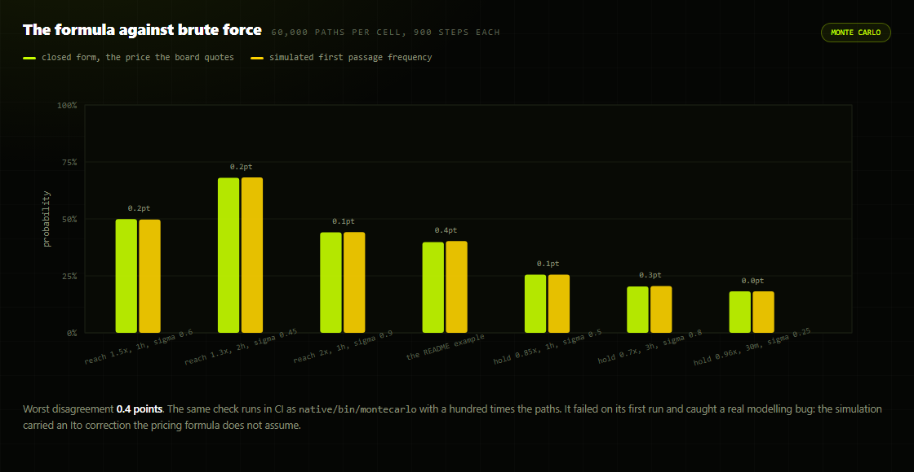
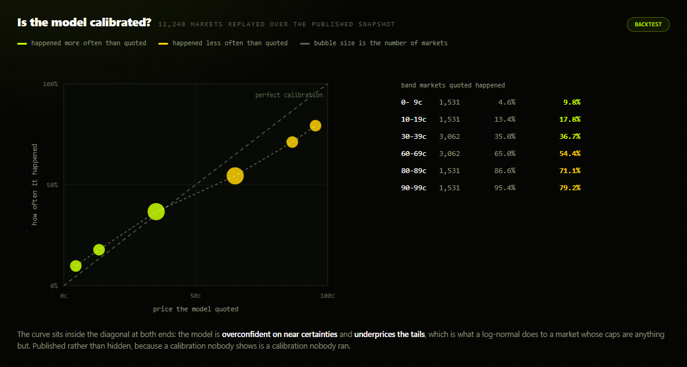
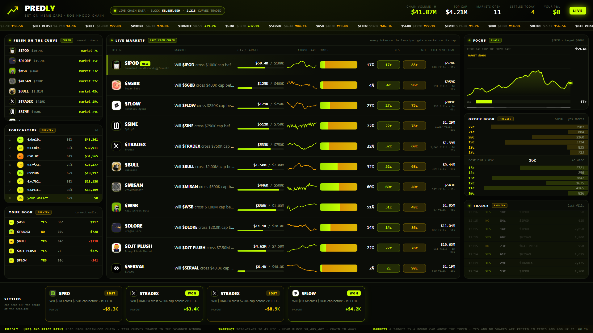

<p align="center">
  
</p>

<p align="center">
  <a href="https://github.com/Denis101Ka/predly-tools/actions/workflows/tests.yml"></a>
  
  
  
  
  
  
</p>

<h3 align="center">Recompute every price on <a href="https://predly.tech">predly.tech</a>, read the chain yourself, run the board offline.</h3>

---

## Table of contents

- [What Predly is](#what-predly-is)
- [Why this repository exists](#why-this-repository-exists)
- [Verify a price in 30 seconds](#verify-a-price-in-30-seconds)
- [Three engines, one price](#three-engines-one-price)
- [How a price is made](#how-a-price-is-made)
- [Why the goalposts move](#why-the-goalposts-move)
- [How a market resolves](#how-a-market-resolves)
- [Where the data comes from](#where-the-data-comes-from)
- [The native tools](#the-native-tools)
- [The board, offline](#the-board-offline)
- [The published data](#the-published-data)
- [Repository layout](#repository-layout)
- [Reproduce everything](#reproduce-everything)
- [What this repository is not](#what-this-repository-is-not)
- [Questions people actually ask](#questions-people-actually-ask)

---

## What Predly is

**Predly** puts a prediction market on the market cap of every memecoin launched on
[Robinhood Chain](https://predly.tech) (chain id `4663`, blocks roughly 101 ms apart). The board
ranks the busiest tokens and gives each of them templated YES/NO questions about its own cap:

> Will **$SLOTH** reach **$154K** within the hour
> Will **$PONS** double from **$493M** before 21:35 UTC
> Will **$DLORE** stay above **$39K** till 15:00 UTC

Shares are quoted in whole cents. YES and NO always add up to a dollar, so a price of `62c` is a
probability of 62% with no conversion in between. Nobody votes on the outcome and there is no
dispute window: resolution reads the cap off the chain and applies arithmetic.

## Why this repository exists

A prediction market is worth exactly as much as its numbers are checkable. Anyone can render a
green number on a black background. The interesting question is whether that number falls out of
public data when somebody else computes it.

**This repository is the check.** It holds:

- the pricing engine, implemented three times in three languages, sharing one set of test vectors
- the chain readers that produce the data, with every event topic and decoding rule written down
- a Monte Carlo validation of the closed-form formula, because an implemented formula and a
  correct formula are different claims
- a calibration backtest that replays historical price paths and asks the only question that
  matters: when the model says 30c, how often does it actually happen
- the raw snapshots, committed on a schedule, so the history is diffable
- an offline copy of the board that runs from those snapshots with no server

None of it needs an account, an API key, or trust in us.

## Verify a price in 30 seconds

```bash
git clone https://github.com/Denis101Ka/predly-tools && cd predly-tools
python -m verify --cap 493e6 --target 986e6 --sigma 0.35 --hours 5.5
```

```
touch  d=0.8445  p_yes=0.3984  YES 40c / NO 60c
```

That is the same `40c` the board quotes for a `$PONS` day market with a `$493M` cap, a `$986M`
target and five and a half hours left. Replay every published example at once:

```bash
python -m verify --vectors
```

```
  ok   README worked example, $PONS day market   expected 40c  got 40c
  ok   hour reach, mid cap meme                  expected 78c  got 78c
  ok   hour hold, same token                     expected  5c  got  5c
  ok   day double, fresh launch                  expected 92c  got 92c
  ok   target already passed                     expected 97c  got 97c
  ok   floor far below, quiet token              expected 44c  got 44c
  ok   minute left, target far                   expected  9c  got  9c
  ok   clamp ceiling, floor barely below         expected  3c  got  3c
  ok   clamp floor, target unreachable           expected  3c  got  3c

9/9 vectors reproduced
```

<p align="center">
  
</p>

No install, no dependencies, standard library only.

## Three engines, one price

The same formula lives in this repository three times. That is not redundancy for its own sake:
each copy has a job, and the fact that they must agree is what keeps any one of them honest.

| Engine | File | What it is for |
|---|---|---|
| **Python** | [`verify/odds.py`](verify/odds.py) | the readable reference, the CLI, the thing you run to check one number |
| **TypeScript** | [`verify/odds.ts`](verify/odds.ts) | mirrors the engine that prices in the browser, so the screen and the server cannot drift |
| **C++** | [`native/odds.hpp`](native/odds.hpp) | the workhorse: millions of simulated paths and full-grid backtests |

CI runs all three on every push, replays [`verify/vectors.json`](verify/vectors.json) through
each, and then **diffs the cents they print**. A single cent of disagreement fails the build.

```
python and typescript agree
python and c++ agree
three engines, identical cents on every vector
```

## How a price is made

The cap is treated as a driftless log-normal walk. For a **touch** market the reflection
principle gives the probability that the running maximum reaches the target before the deadline;
a **floor** market is the complement of the same expression.

```
touch   d = ln(target / cap) / (σ · √τ)      p_yes = clamp( 2 · (1 − Φ(d)),  0.03, 0.97 )
floor   d = ln(cap / floor)  / (σ · √τ)      p_yes = clamp( 2 · Φ(d) − 1,    0.03, 0.97 )

σ   realized volatility per hour: sample std of 5-minute close-to-close log returns
    over the trailing six hours, × √12, clamped to [0.05, 3]
τ   hours left until the deadline, floored at one minute
Φ   standard normal CDF (Abramowitz & Stegun 26.2.17, not erf, so every engine
    rounds to the same cent on every platform)

yes_c = clamp(round(p_yes · 100), 1, 99)     no_c = 100 − yes_c
```

Worked through, step by step:

```
d     = ln(986 / 493) / (0.35 · √5.5)
      = 0.6931 / 0.8208
      = 0.8445
p_yes = 2 · (1 − Φ(0.8445))
      = 2 · (1 − 0.8008)
      = 0.3984                                →  40c YES  /  60c NO
```

<p align="center">
  
</p>

Both panels are drawn straight out of `verify/odds.py`: the left one walks a cap toward a fixed
target at three volatilities, the right one runs the clock down on three different targets. The
shape is the whole product. A market with hours left and a target within reach hovers near the
middle, where it is worth trading; the same market with four minutes left has already made up its
mind.

The clamp at `[0.03, 0.97]` is not decoration. A market never quotes certainty, because the model
is never certain; the clamp is where the model admits it has stopped knowing.

## Why the goalposts move

The obvious way to write a market on a memecoin is *"will it go up 50%"*. It is also useless. A
token worth half a billion moves a few percent an hour. A token nine minutes old moves fifty. The
same question is a coin flip for one and a lottery ticket for the other, and a board built out of
those questions is a board where every row reads 3c or 97c. Nobody trades a row that is already
decided.

So the target sits a fixed number of standard deviations away from the cap instead:

```
target = cap · exp( k · σ · √T )
```

The quiet half-billion token and the nine-minute-old meme end up with questions that are roughly
as hard as each other, and the cents spread across the whole range. The target is measured at the
window's open, from candles that closed **before** it, and then frozen: goalposts that move while
a market is live are not goalposts.

Full reasoning, including why drift is deliberately left out of the model:
[docs/METHODOLOGY.md](docs/METHODOLOGY.md).

## How a market resolves

| Template | Question | Window | Resolves YES when |
|---|---|---|---|
| `reach` | will the cap reach a level above it | 1 hour | the cap touches the target at any point |
| `hold` | will the cap stay above a level below it | 1 hour | the cap never touches the floor |
| `double` | will the cap double from the open | 1 day | the cap touches twice the opening cap |

A touch market resolves **early** — the moment the candles show the target reached, not at the
deadline, because the question was whether it *reaches*, not where it ends. A floor market
resolves NO the moment the floor is breached. Anything still open at the deadline settles on the
cap at the deadline.

What happens on a candle gap, a pool migration, an exact touch, a reorg, or a token whose quote
leg decodes in the wrong units: [docs/RULEBOOK.md](docs/RULEBOOK.md), written before the arguments
rather than after them.

## Where the data comes from

Nothing in `data/` is typed by hand. The readers speak to the public RPC directly, take the
launchpad curve's own trade events, and price every fill as the executed ratio of quote to tokens.



<p align="center">
  
</p>

| What | How it is derived | Where |
|---|---|---|
| Token list, caps, volumes, fill counts | curve `BUY` / `SELL` logs, price = quote ÷ tokens, cap = price × 1e9 supply | [`chain/fetch_chain.py`](chain/fetch_chain.py) |
| Launch name, image, links | printable strings inside the token's creation transaction, images from IPFS | [`chain/fetch_logos.py`](chain/fetch_logos.py) |
| Odds in cents | the formula above, from the cap and the candles | [`verify/`](verify) |
| Calibration | historical paths replayed against the model | [`native/backtest.cpp`](native/backtest.cpp) |
| Everything else on the demo board | a product preview, badged `PREVIEW` on the panel itself | [`board/build_board.py`](board/build_board.py) |

The two event topics, the supply constant, the ETH/USDG conversion and the traps live in
[docs/CHAIN.md](docs/CHAIN.md). The nastiest one is worth repeating here: some curves quote in
ETH and some in USDG, and a fill decoded in the wrong units puts a token's cap off by a factor of
`1e12`. Every reader trims price paths around their own median and drops a token whose implied
cap leaves a sane range entirely.

## The native tools

```bash
make -C native            # four binaries into native/bin, C++17, no dependencies
```

**`vectors_test`** replays the shared vectors through the C++ engine, plus the invariants: cents
summing to a dollar, a closer target never being cheaper, time helping a touch market and hurting
a floor market.

```bash
./native/bin/vectors_test verify/vectors.json
```

**`montecarlo`** answers a question the unit tests cannot: is the closed form *correct*, not just
correctly implemented. It simulates a driftless log-normal walk at a fine time step, counts how
often the running maximum reaches the target, and compares that frequency with the analytic
price.

```bash
./native/bin/montecarlo 200000 --steps 2000
```

<p align="center">
  
</p>

It failed the first time it ran, which is exactly what it was built for: the simulation carried
an Itô correction that the pricing formula does not assume, and the two processes disagreed by
ten points of probability. The fix is in the history, the modelling choice is now named in
[docs/METHODOLOGY.md](docs/METHODOLOGY.md), and the check runs on every push.

**`backtest`** sweeps the market templates across every price path in a snapshot: open a market
at each point in the series, price it with the same engine, walk forward, record whether it would
have resolved YES, then group by the price the model quoted. That grouping is a calibration
table, and it is the only honest answer to *"when Predly says 30c, how often does it happen"*.

```bash
./native/bin/backtest data/snapshot-latest.json --csv calibration.csv
```

<p align="center">
  
</p>

The answer today is unflattering and published anyway: the model is **overconfident on near
certainties** and **underprices the tails**. Markets it quoted around 95c happened about 79% of
the time; markets it quoted under 10c happened about 10% of the time when it expected 5%. That is
what a log-normal does to an asset whose caps are anything but log-normal, and it is the kind of
number a project only shows when the number is real.

**`odds`** is the native mirror of the Python CLI, plus a throughput mode, because the difference
between three engines matters when you are pricing a few million markets:

```bash
./native/bin/odds --cap 188e6 --sigma 0.42 --hours 1 --ladder
./native/bin/odds --bench 5000000
```

CMake is wired up as well if your toolchain prefers it:

```bash
cmake -S native -B native/build -DCMAKE_BUILD_TYPE=Release && cmake --build native/build
ctest --test-dir native/build --output-on-failure
```

## The board, offline

<p align="center">
  
</p>

```bash
python chain/fetch_chain.py 60000      # scan the last 60k blocks, about 1.7 hours of chain
python chain/fetch_logos.py            # pull each token's launch image out of its birth tx
python board/build_board.py PREDLY     # write board/board.html
```

Open `board/board.html` in any browser. One file, no server, no build step: real caps, real
volumes, real price paths, real launch images, every modelled panel badged `PREVIEW`. Add
`--shot 26000` to render it straight to a PNG instead of opening it.

The generated HTML is deliberately **not** committed — the builder and the snapshot are, which is
what makes the output reproducible instead of merely present.

## The published data

`data/snapshot-latest.json` is refreshed by a scheduled workflow and dated copies land in
`data/history/`. One token looks like this:

```jsonc
{
  "curve": "0x9e8930081c09c924a1ed45b618c4282542c23094",
  "token": "0xa13647d7f99b48a42deba810d6c037b0293ad963",
  "symbol": "BULL",
  "trades": 399,            // fills seen inside the scanned window
  "vol_usd": 9347968.0,     // executed volume, both sides
  "unit": "ETH",            // which leg the curve quotes in
  "last": 4.34e-7,          // last executed price, quote per token
  "cap_usd": 1084716.0,     // last * 1e9 supply, converted at the pool rate
  "first_block": 58447017,
  "last_block": 58485402,
  "path": [ /* up to 160 executed prices, oldest first */ ],
  "meta": {
    "long_name": "Bullcoin",
    "birth_tx": "0xda7ee79a...",
    "logo_cid": "Qm...",
    "post": "https://x.com/..."
  },
  "logo": "data:image/png;base64,..."   // 96px thumbnail, so the board stays one file
}
```

Every field is derived, never entered. If a number here disagrees with your own scan, that is a
bug worth an issue, and the block numbers in the file are enough to reproduce it.

## Repository layout

```
verify/     the odds engine twice: odds.py and odds.ts, one vectors.json, both test suites
native/     the C++ engine: vectors test, Monte Carlo validation, calibration backtest, CLI
chain/      the RPC readers that produce the snapshots
board/      the offline board generator
data/       snapshot-latest.json, dated history, cached launch images
brand/      banner and figure generators, rendered from HTML so the type stays crisp
docs/       methodology, market rulebook, chain notes
scripts/    verify.sh and snapshot.sh, the two commands that do everything above
```

## Reproduce everything

```bash
./scripts/verify.sh          # both scripting engines, the vectors, the invariants
./scripts/verify.sh --full   # plus a live chain scan and a fresh board
make -C native check         # the native engine and the Monte Carlo validation
```

Test counts today: **12** Python tests, **10** Node tests, **3** native suites, all replaying the
same vectors, plus the cross-language cent diff in CI.

## What this repository is not

It is not the Predly application. The site's server and front end are closed; what lives here is
everything a visitor needs to audit the numbers, plus the tools that produced them.

Trading on the site is **paper only** at this stage. Positions live in the visitor's browser, no
order is ever sent, and the wallet connection is read-only — the site never requests a signature
and never builds a transaction. See [SECURITY.md](SECURITY.md) for how to verify that yourself
from the network tab rather than taking our word for it.

Odds are **model-derived**, not bet-derived. On a book with real depth the price is the crowd's
opinion; here it is a volatility model's opinion, which is a different thing and is labelled as
such everywhere it appears.

## Questions people actually ask

**Are the odds just made up?**
Run `python -m verify --vectors`, then run `./native/bin/montecarlo`. The first shows the price is
reproducible; the second shows the formula behind it matches brute-force simulation. Both take
seconds.

**Can the site touch my wallet?**
No. It reads an address and its balances. It never asks for a signature, never builds a
transaction, and never sees a key. The moment a Predly page asks you to sign something, it is not
a Predly page.

**What if the data source is wrong?**
Then the market built on it is wrong, and the rulebook says what happens: a cap proven to be a
decoding artifact voids the market rather than resolving it. Everything upstream of that is in
[docs/CHAIN.md](docs/CHAIN.md) so you can check the derivation rather than the conclusion.

**Why not settle on-chain?**
Because settling on-chain without the market being on-chain would be theatre. The honest version
is the current one: paper trading, stated plainly, with the pricing and the data fully open.

**Why three languages for one formula?**
Because "the site says 40c" and "the formula says 40c" are different sentences, and the only way
to keep them the same is to compute it in three independent places and diff the results on every
commit.

---

<p align="center">
  <a href="https://predly.tech">predly.tech</a> ·
  <a href="docs/METHODOLOGY.md">methodology</a> ·
  <a href="docs/RULEBOOK.md">rulebook</a> ·
  <a href="docs/CHAIN.md">chain notes</a> ·
  <a href="SECURITY.md">security</a> ·
  <a href="CONTRIBUTING.md">contributing</a> ·
  <a href="LICENSE">MIT</a>
</p>
